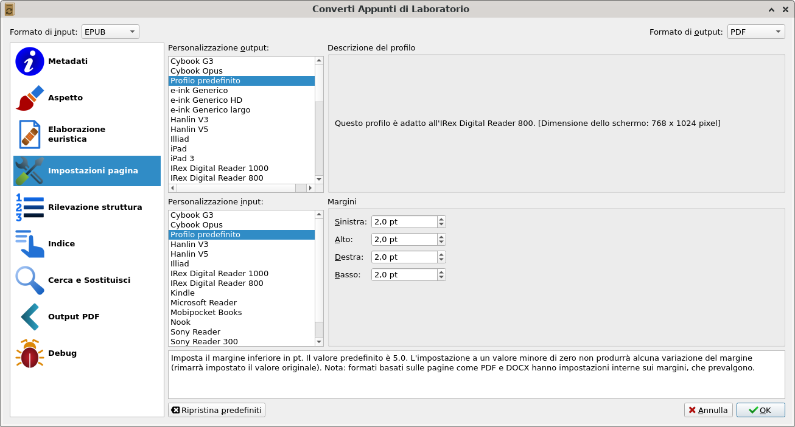
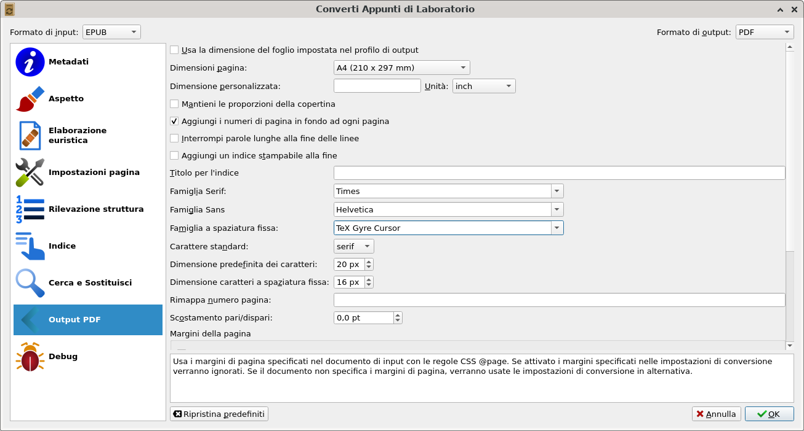

# from-hugo-to-book

This repository contains the script and the contents needed to publish the ebook (from Hugo articles).

Update author and rights informations in the files ``ebook_title.txt`` and ``epub_metadata.xml``.

## PDF output

Use the free and open source [https://calibre-ebook.com/](Calibre e-book manager) to generate the pdf version of the book (pandoc & LaTeX are a little hard to produce a good pdf version).

The steps are the following:

- add the ebook to calibre;
- right click on the ebook and click the item "convert";
- in the top right side, choose the output format "PDF";
- choose the conversion options, like in the following screenshots.

## License

This repository is released under the [Creative Commons Zero v1.0 Universal License](https://github.com/codingepaduli/from-hugo-to-book/blob/master/LICENSE).
